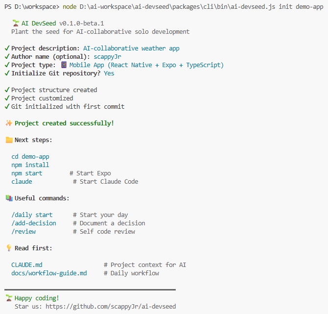

# 🌱 AI DevSeed

> Plant the seed for AI-collaborative solo development

[](https://www.npmjs.com/package/ai-devseed)
[](https://opensource.org/licenses/MIT)
[](.)

**AI DevSeed** is a project starter kit designed for solo developers who collaborate with AI assistants like Claude Code. In one command, get a fully-structured project with documentation, workflow guides, ADR templates, and Claude-ready configurations.

```bash
npx ai-devseed init my-app
```

That's it. Your project is ready in 30 seconds. ✨

<p align="center">
  
</p>

---

## 🤔 Why AI DevSeed?

Solo developers using AI assistants face a unique challenge: **AI works best with rich context**, but creating that context takes hours. Every new project means rewriting the same `CLAUDE.md`, the same workflow guides, the same ADR templates.

AI DevSeed solves this by giving you a **battle-tested project foundation** built specifically for AI collaboration. It's the result of building real apps with AI from day one.

### The Problem

❌ Hours spent setting up `CLAUDE.md`, ADR folders, workflow docs
❌ Every project reinvents the same patterns
❌ AI loses context because docs are inconsistent
❌ Solo dev becomes "solo + chaos"

### The Solution

✅ One command, complete setup
✅ AI-optimized project structure
✅ Real-world patterns from actual projects
✅ Single source of truth philosophy

---

## ✨ What You Get

### 📁 Smart Folder Structure
```
my-app/
├── CLAUDE.md              ← AI context file (auto-loaded)
├── README.md
├── CHANGELOG.md
├── .claude/
│   ├── settings.json      ← Permissions & rules
│   └── commands/          ← Custom slash commands
├── .github/               ← Issue templates + label setup script
├── docs/
│   ├── architecture.md
│   ├── decisions/         ← ADR (Architecture Decision Records)
│   ├── ideas/             ← Idea management system
│   ├── journal/           ← Daily work logs
│   ├── retrospective/     ← Weekly retrospectives (used by /retro)
│   └── workflow-guide.md  ← Daily workflow + Git + Branch Protection
└── wbs/                   ← Work breakdown structure
```

### 🤖 AI-Ready Configurations
- **CLAUDE.md** template with project context structure
- **Custom slash commands**: `/daily`, `/idea`, `/add-decision`, `/handoff`, `/retro`, `/review`, `/explore`, `/test-plan` (+ `/new-screen` for mobile, `/new-page` for web)
- **Permission settings** to keep your `.env` safe
- **Single source of truth** philosophy baked in

### 📋 Project Management Tools
- WBS (Work Breakdown Structure) checklist
- Idea management system (Inbox / Big Ideas / GitHub Issues)
- ADR templates for documenting decisions
- Daily journal template

### 🐙 GitHub Integration
- Issue templates (Bug / Feature / Task)
- Label setup script (one command, 17 labels)
- Branch protection guide (in `workflow-guide.md`)
- Conventional Commits guide

---

## 🚀 Quick Start

### Installation
```bash
# No installation needed - use npx
npx ai-devseed init my-app

# Or install globally
npm install -g ai-devseed
ai-devseed init my-app
```

### Interactive Setup

The CLI walks you through a few quick questions:

- **Project name** (used as the folder name)
- **Description** *(optional)*
- **Author** *(optional)*
- **Project type** — Mobile (React Native + Expo), Web (React + Vite), or Generic
- **Initialize Git?** (default: yes)

The full flow takes ~30 seconds — see the screenshot near the top of this README for the actual output.

### Start Coding
```bash
cd my-app

# Open Claude Code (will read CLAUDE.md automatically)
claude

# Try a custom command
/daily start
```

---

## 🆚 Free vs Pro

| Feature | Free | Pro ($19) |
|---------|------|-----------|
| **Core Templates** | ✅ | ✅ |
| Folder structure | ✅ | ✅ |
| CLAUDE.md template | ✅ | ✅ |
| Mobile template (RN + Expo) | ✅ | ✅ |
| Web template (React + Vite) | ✅ | ✅ |
| Basic ADR templates | ✅ | ✅ |
| 8 essential slash commands | ✅ | ✅ |
| Label setup script (17 labels) | ✅ | ✅ |
| GitHub setup guide | ✅ | ✅ |
| Markdown WBS | ✅ | ✅ |
| **Pro Features** | | |
| 12 extended slash commands | ❌ | ✅ |
| 10 ADR scenario templates | ❌ | ✅ |

[**Get Pro →**](https://haemcheephox.gumroad.com/l/ai-devseed-pro)

---

## 📚 Documentation

- [Getting Started](docs/getting-started.md) - Your first project in 5 minutes
- [Workflow Guide](packages/cli/templates/base/docs/workflow-guide.md) - Preview of the daily workflow your bootstrapped project gets

Philosophy is covered in the [💡 Philosophy](#-philosophy) section below.

---

## 🌟 Real Example

AI DevSeed was extracted from real solo development projects. See it in action:

- **Otori** *(public release pending — currently in private development)* — A weather-based outfit recommendation app, built solo with Claude Code in 60 days using these exact templates.

---

## 🛣️ Roadmap

### v0.1 (Beta) - Current
- [x] Core templates
- [x] CLI tool
- [x] Mobile (RN) + Web (React) templates
- [x] Pro tier launch (v0.1.0 — 12 commands + 10 ADR scenarios)
- [ ] Documentation site

### v0.2
- [ ] More templates (CLI, library, fullstack)
- [ ] AI-powered customization
- [ ] Plugin system

### v1.0
- [ ] Stable API
- [ ] Community templates
- [ ] Enterprise features

---

## 💡 Philosophy

AI DevSeed is built on three principles:

1. **Single Source of Truth** - Each piece of information lives in exactly one place
2. **AI-First Documentation** - Docs are designed for AI to read and contribute
3. **Solo But Not Alone** - You + AI is a team. Set up like one.

---

## 🤝 Contributing

This is a beta project! Feedback is incredibly valuable.

- 🐛 **Found a bug?** [Open an issue](https://github.com/scappyJr/ai-devseed/issues)
- 💡 **Have an idea?** [Start a discussion](https://github.com/scappyJr/ai-devseed/discussions)
- 🎨 **Want to add a template?** See [CONTRIBUTING.md](CONTRIBUTING.md) for branch flow, commit conventions, and local setup. PRs welcome.

---

## 📄 License

MIT License - See [LICENSE](LICENSE) for details.

The Free tier (CLI + templates) is MIT. The Pro tier is **source-visible** at [`pro/`](pro/) in this repo under a [personal/team-use license](pro/LICENSE) — open-source-pricing model (curation + lifetime updates + sponsorship via Gumroad), not gating.

---

## 🙏 Made by

A solo developer building real things with AI.

If AI DevSeed helps you, consider:
- ⭐ Starring this repo
- 📣 Sharing on Reddit / Dev.to
- 💝 Getting [Pro](https://haemcheephox.gumroad.com/l/ai-devseed-pro) to support development
- ☕ [Buying me a coffee](https://ko-fi.com/scappyjr)

---

<div align="center">

**Made with 🌱 for the AI-collaborative future of solo development**

[Pro](https://haemcheephox.gumroad.com/l/ai-devseed-pro)

</div>
