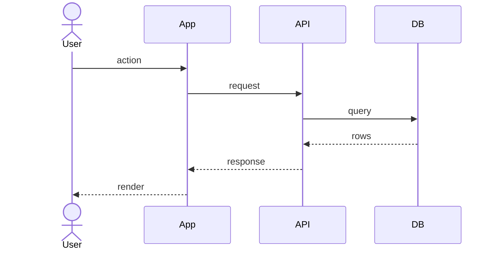
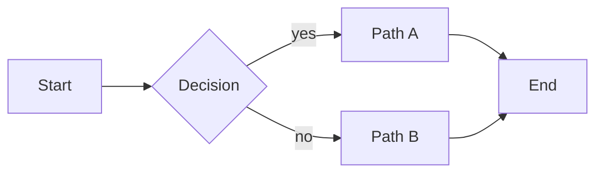
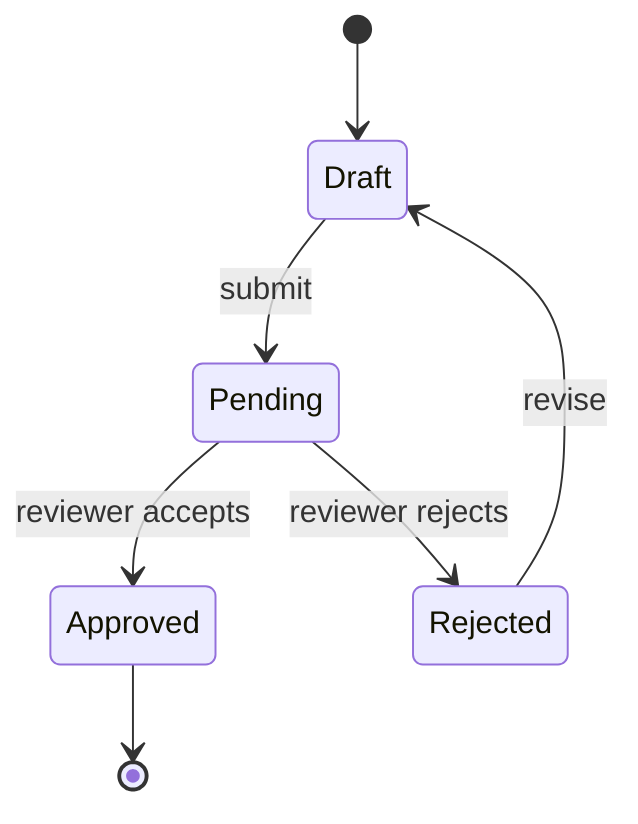
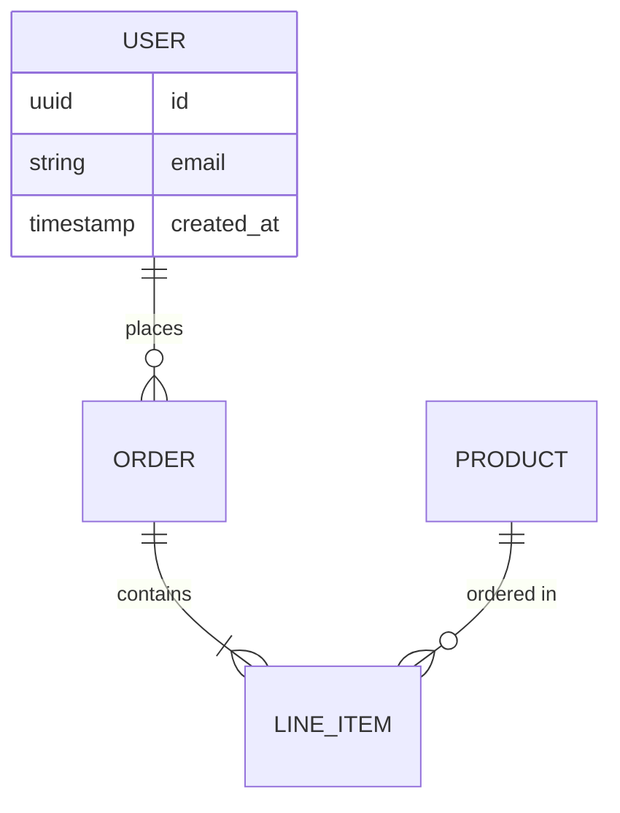

Generate a diagram that survives version control (text, not images). Mermaid renders inline on GitHub, GitLab, and most modern docs — no external tool needed to view.

## When to use

- Documenting a non-trivial data flow in an ADR or postmortem
- Onboarding doc that benefits from a structural picture
- Before/after view for a `/refactor-plan`

**Not** for: a folder tree (use `tree` output), trivial 2-node flows (sentences suffice).

## How it works

1. Ask (or detect from inline arg): "What do you want diagrammed?"
2. Ask: "What kind?" — present these options if not obvious:
   - **Flowchart** (`graph LR/TD`) — generic decision/process flow
   - **Sequence** — interactions over time (most common for request/auth/payment flows)
   - **ER** — database relationships
   - **State** — state machine of an entity
   - **Class** — type hierarchy / domain model
3. Read just enough to know the shape (cap at ~5 files). Don't read the whole repo.
4. Draft the Mermaid block.
5. **Lint-check by eye**: at least one node, at least one edge, no syntax obviously broken (unmatched brackets, unknown shapes). Mermaid errors render as a confusing red box on GitHub — worse than no diagram.
6. Print the block inline. Ask: "Save to `docs/diagrams/{slug}.md`, embed in an existing doc, or just display?"
7. On save, create `docs/diagrams/` if missing.

## Output templates

### Sequence (most common)



### Flowchart



### State



### ER (database)



### File-form

When saved, the file should be:

```markdown
# {Diagram title}

**Type**: {sequence | flowchart | state | ER | class}
**Drawn**: {YYYY-MM-DD}
**Scope**: {1 line — what this does and does NOT show}

\`\`\`mermaid
{the diagram block}
\`\`\`

## Notes

- {Anything the diagram omits but is worth knowing}
- {Caveats, e.g., "error paths not shown — see {file} for those"}
```

## Rules

- **Mermaid only.** ASCII art is unreadable in long docs; image files rot. Mermaid renders directly in GitHub/GitLab/most docs and stays diffable as text.
- **One concept per diagram.** A diagram showing "auth + payment + email" shows none of them well. Split.
- **Label the omissions.** Every diagram is a simplification. The Notes section is where you flag what was left out so the reader doesn't trust it as exhaustive.
- **Don't auto-save without confirmation.** Bad diagrams in `docs/` are worse than none — they get cited as truth.
